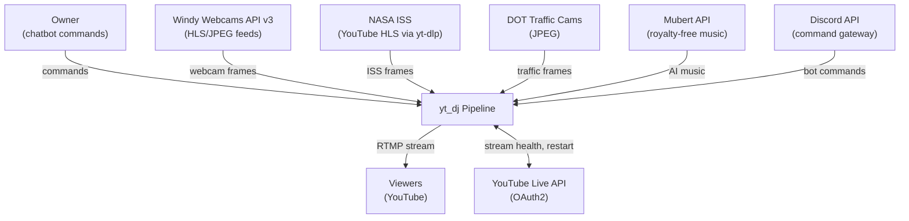
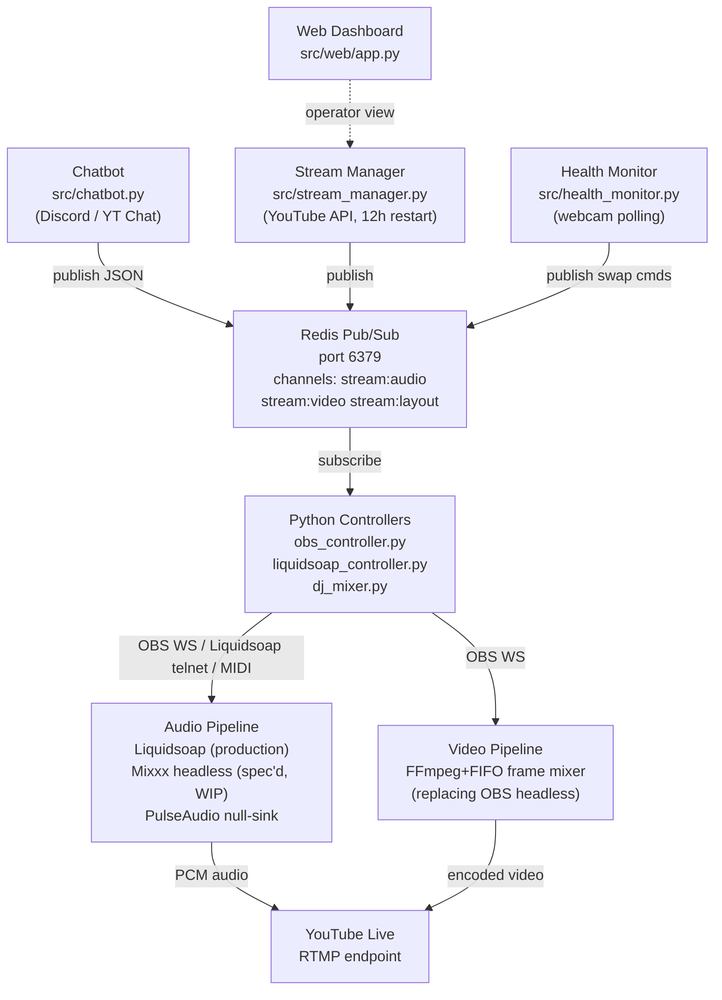

# yt_dj — System Decomposition Map

> **Advisory only.** This map reflects architectural intent derived from specs, contracts, and
> source inspection. It is not normative — the code is authoritative.

---

## System Context (C4 L1)

A 24/7 YouTube Live stream that continuously broadcasts global webcam feeds with DJ-mixed music,
controllable by the owner in real time via chatbot commands.

---

## Containers (C4 L2)

---

## Component Registry

| Component | Path | Role | Provenance |
|-----------|------|------|-----------|
| `go_live.py` | `src/go_live.py` | Stream entrypoint; wires frame mixer + FFmpeg + audio | [derived] |
| `frame_mixer.py` | `src/frame_mixer.py` | Fetches webcam images, alpha-blends dissolves, writes raw RGB24 to FIFO at 30fps | [derived] |
| `solar_scorer.py` | `src/solar_scorer.py` | Ranks camera feeds by pvlib solar position; prefers golden hour (elevation 0–10°) | [derived] |
| `overlay.py` | `src/overlay.py` | Writes location + local time to `/tmp/yt_dj_overlay.txt` for FFmpeg drawtext reload | [derived] |
| `webcam_client.py` | `src/webcam_client.py` | Fetches JPEG/HLS frames from Windy, DOT, NASA ISS via httpx + yt-dlp | [derived] |
| `compositor.py` | `src/compositor.py` | Original OBS-based grid compositor (superseded by frame_mixer in visual-identity slug) | [derived] |
| `obs_controller.py` | `src/obs_controller.py` | Redis subscriber; translates stream:video commands to OBS WebSocket v5 calls | [derived] |
| `liquidsoap_controller.py` | `src/liquidsoap_controller.py` | Redis subscriber; translates stream:audio commands to Liquidsoap telnet | [derived] |
| `dj_mixer.py` | `src/dj_mixer.py` | Beat-matched queue builder; interfaces Mixxx via MIDI bridge (automated-dj-mixing slug) | [derived] |
| `analyze_library.py` | `src/analyze_library.py` | Offline essentia analysis — extracts BPM, key, energy; writes `config/track_metadata.json` | [derived] |
| `command_bus.py` | `src/command_bus.py` | Redis Pub/Sub wrapper; shared by all publishers and subscribers | [derived] |
| `health_monitor.py` | `src/health_monitor.py` | Polls webcam URLs every 60s; publishes swap commands on dead feeds | [derived] |
| `stream_manager.py` | `src/stream_manager.py` | Monitors YouTube stream health via API; auto-restarts at 12h boundary | [derived] |
| `chatbot.py` | `src/chatbot.py` | Discord bot / YouTube Chat poller; parses owner commands, publishes to Redis | [derived] |
| `mubert_client.py` | `src/mubert_client.py` | Calls Mubert API for autonomous music generation in unattended mode | [derived] |
| `web/app.py` | `src/web/app.py` | Operator web dashboard | [derived] |
| `cameras.json` | `config/cameras.json` | Feed database: 30+ entries with lat/lon, timezone, source URL, category | [derived] |
| `webcams.json` | `config/webcams.json` | Legacy webcam list (OBS-era; used by original compositor) | [derived] |
| `track_metadata.json` | `config/track_metadata.json` | Per-track BPM, key, energy from offline essentia analysis | [derived] |
| `liquidsoap.liq` | `config/liquidsoap.liq` | Liquidsoap script: playlist, crossfade, telnet server config | [derived] |
| `stream.json` | `config/stream.json` | YouTube stream key, OBS password, RTMP target | [derived] |
| `yt-dj.service` | `scripts/yt-dj.service` | Top-level systemd unit; starts all pipeline services | [derived] |
| `obs-headless.service` | `scripts/obs-headless.service` | OBS headless service with Xvfb :99 | [derived] |
| `liquidsoap.service` | `scripts/liquidsoap.service` | Liquidsoap playout service | [derived] |

---

## Crosscutting Conventions

- All pipeline control flows through Redis Pub/Sub — no direct chatbot-to-OBS or chatbot-to-Liquidsoap calls
- Redis command message format: `{"action": "...", "params": {...}, "source": "chatbot|health_monitor|auto"}`
- Redis channels: `stream:audio`, `stream:video`, `stream:layout`
- Python source in `src/`, config in `config/`, systemd units in `scripts/`, tests in `tests/`
- Every service runs as a systemd unit with watchdog; all services start via `systemctl start yt-dj`
- YouTube 12-hour stream limit is a hard constraint — auto-restart logic is mandatory
- Prefer low-resolution / scenic / traffic webcam feeds to minimize GDPR exposure from EU sources
- Mubert API is autonomous/unattended-only; owner's DJ library is the primary music source
- All Mixxx control flows through virtual MIDI (`snd-virmidi`) — no direct Mixxx API exists
- Track library pre-analyzed offline (essentia); no runtime audio analysis

---

## Key Decisions

| Decision | Rationale | Slug |
|----------|-----------|------|
| OBS headless + Liquidsoap + Redis as primary v1 architecture | OBS provides richest scene manipulation via obs-websocket; Liquidsoap is battle-tested for 24/7 playout; Redis decouples control surfaces | youtube-dj-webcam-streams |
| FFmpeg+FIFO replaces OBS for video pipeline | OBS xfade requires all inputs at launch; FIFO decouples frame generation from encoding; no Xvfb needed | channel-visual-identity |
| Mixxx headless via virtual MIDI replaces Liquidsoap for audio | Liquidsoap only does volume crossfades; Mixxx provides beat-matched, harmonically aware mixing | automated-dj-mixing |
| Single full-screen cam with dissolve replaces 2x2 grid | Research shows ambient streams use single-view; grid reads as CCTV surveillance | channel-visual-identity |
| pvlib solar scoring prefers golden hour (elevation 0–10°) | Creates "sun-chasing" aesthetic; varies visual mood without manual curation | channel-visual-identity |
| Pre-analyze tracks offline, no runtime audio analysis | Avoid per-track latency at queue time; essentia is slow but only needed once | automated-dj-mixing |
| Accept YouTube Content ID claims on commercial music | Full creative freedom over track selection; ad revenue forfeited as trade-off | youtube-dj-webcam-streams |

---

## Active Slug Status

| Slug | Phase | Status |
|------|-------|--------|
| youtube-dj-webcam-streams | execute | foundation complete |
| automated-dj-mixing | execute | spec'd, WIP |
| channel-visual-identity | execute | **active** — approved contract, deliverables in progress |
