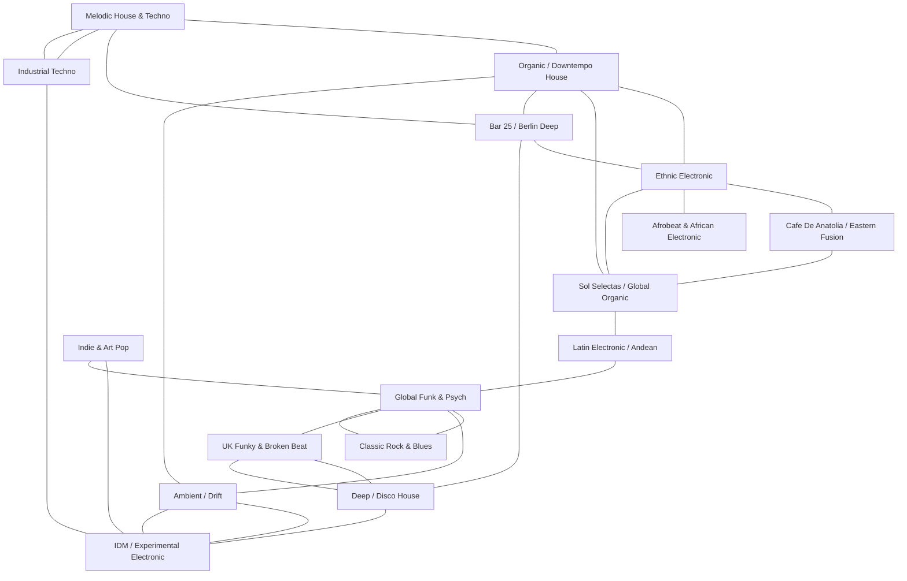

# Music Genome

> A multi-dimensional genre graph for the radio library. Not a tree — nodes connect to multiple families.
> Think phylogenetic network, not taxonomy. A track can be native to one genus and adjacent to three others.
>
> **Conventions:**
> - `[library]` = track is in the current library
> - `[ ]` = slot to fill — a natural extension point
> - Edges are undirected unless marked `→` (influence direction known)
> - Fill in new nodes as you collect. Add edges as you discover connections.

---

## Topology (graph overview)

*Nodes in **bold** have library holdings. Grey nodes are mapped but unrepresented — extension targets.*

---

## Genus Sheets

Each sheet: description · sonic signature · geographic roots · era · edges · library holdings · open slots.

---

### Melodic House & Techno

**What it is:** European club music where melody and emotional arc take precedence over pure dancefloor function. Builds over long journeys — 8, 10, 12 minutes. Piano, strings, distorted synths over 120–126 BPM 4/4 framework.

**Sonic signature:** Long build structures, melancholic or euphoric melodic hooks, clean production, occasional vocals as texture rather than song. The "peak time" of the organic-leaning circuit.

**Geographic roots:** Germany (Berlin, Hamburg), Scandinavia, spreading globally post-2015.

**Era:** 2012 → present. Accelerated via labels like Afterlife, Cercle streams, Tale Of Us.

**Key labels:** Afterlife, Stil Vor Talent, Embassy One, Diynamic

**Edges:**
- → **Organic / Downtempo House** (tempo reduction, naturalistic sound design)
- ↔ **Bar 25 / Berlin Deep** (shared geography, emotional DNA)
- → **Ambient / Drift** (extended intro/outro zones bleed into ambient)

**Library holdings:**
- [library] Ben Böhmer — Strangers (Original Mix)
- [library] Monolink — Sirens (Original Mix)
- [library] Oliver Koletzki — Zeitgeist (Original Mix) [Stil Vor Talent]
- [library] Oliver Koletzki & Hidden Empire — Elevation (Original Mix) [Stil Vor Talent]
- [library] Solatic — Cryptic (Original Mix)
- [library] Solatic — Passeri (Original Mix)

**Open slots:**
- [ ] Tale Of Us (Afterlife label anchor)
- [ ] Agents Of Time
- [ ] Anyma
- [ ] Stephan Bodzin
- [ ] Innellea

---

### Organic / Downtempo House

**What it is:** The softer pole of electronic music — grooves that feel handmade, unhurried, rooted in nature metaphors. Acoustic percussion, field recordings, ethnic instrumentation woven into electronic frameworks. Often 100–118 BPM. Sits between "music to dance to" and "music to exist in."

**Sonic signature:** Warm low-end, organic percussion (hand drums, tabla, hang, marimba), minor-pentatonic melodies, reverb-heavy mixes, no sharp edges. The feeling of a dusty outdoor dancefloor at dusk.

**Geographic roots:** Diffuse — Argentinian, Colombian, German, Israeli, Turkish strands all converge here.

**Era:** 2010 → present. Coalesced as a recognizable genre ~2016.

**Key labels:** Sol Selectas, Music For Dreams, Crosstown Rebels, Kompakt

**Edges:**
- ↔ **Melodic House & Techno** (tempo and emotional overlap at the fast end)
- ↔ **Ethnic Electronic** (instrumentation and world-music sourcing)
- ↔ **Sol Selectas / Global Organic** (SOL is essentially this genre's flagship label)
- ↔ **Ambient / Drift** (at the slow end, dissolves into ambient)
- ↔ **Bar 25 / Berlin Deep** (Berlin's take on this aesthetic)

**Library holdings:**
- [library] Be Svendsen — Flint (Original Mix) [Music For Dreams]
- [library] Be Svendsen — Day 3 (Original Mix) [Music For Dreams]
- [library] BONDI — Away From Heaven (Niko Schwind Remix) [Bar 25 Music]
- [library] Can Balka — Bedouin (Original Mix)
- [library] Niko Schwind, Lazarusman — Believe (Original Mix) [Bar25-133]
- [library] Zuma Dionys — Maugli (Original Mix) [Cosmic Awakenings]
- [library] Zuma Dionys — Voodoo Child (Original Mix) [Organic House / Monada]
- [library] Soul Button — Circadian Rhythm (Hraach Remix)

**Open slots:**
- [ ] Nicola Cruz (faster tracks — his slow work lives in Latin Electronic)
- [ ] Bonobo
- [ ] Thievery Corporation (bridge to Global Funk)
- [ ] Balkan Beat Box (bridge to Ethnic Electronic)

---

### Ethnic Electronic

**What it is:** Electronic music whose identity is built from specific cultural sonic vocabularies — Middle Eastern maqam scales, West African polyrhythm, Balkan asymmetric meters, South Asian raga structures. Not fusion for fusion's sake — the ethnic source is load-bearing.

**Sonic signature:** Modal scales outside Western major/minor, microtonal inflections, oud, saz, duduk, kora, or synthesized equivalents, rhythm patterns that don't resolve on beat 1.

**Geographic roots:** Turkey, Lebanon, Israel (Haifa/Tel Aviv scene), West Africa (via diaspora producers), Eastern Europe.

**Era:** 2005 → present. Israeli scene (Shir Khan, Guy J) pioneered early. Turkish labels pushed later.

**Key labels:** Cafe De Anatolia, Bar 25, Crosstown Rebels, Magician On Duty

**Edges:**
- ↔ **Cafe De Anatolia / Eastern Fusion** (direct overlap — CDA is a sub-genus)
- ↔ **Organic / Downtempo House** (shared instrumentation philosophy)
- ↔ **Afrobeat & African Electronic** (West African percussion strand)
- ↔ **Bar 25 / Berlin Deep** (Berlin labels curate heavily from this space)

**Library holdings:**
- [library] Armen Miran ft. Hraach — Aldebaran (Original Mix)
- [library] Chris Schwarzwälder & Mira (Berlin) — Ayun (Original Mix)
- [library] Mira & Chris Schwarzwälder — Leila (Original Mix)
- [library] Mira (Berlin) & Christopher Schwarzwälder — Bedah (Original Mix) [KATERMUKKE]
- [library] Mira (Berlin) & Christopher Schwarzwälder — Deia (Original Mix) [Kiosk I.D.]
- [library] Damian Lazarus & The Ancient Moons — Feedback Loop
- [library] Oceanvs Orientalis — Tarlabasi (Original Mix) [BAR25-042]
- [library] Oceanvs Orientalis — Aliens (Original Mix)

**Open slots:**
- [ ] Acid Arab
- [ ] Ziad Rahbani (Lebanese jazz — ancestor node)
- [ ] Oum Kalthoum → (distant ancestor, influence vector)
- [ ] Guy J
- [ ] Shir Khan

---

### Cafe De Anatolia / Eastern Fusion

**What it is:** A specific Turkish-rooted sub-genre and label ecosystem. Takes traditional Anatolian, Greek, Armenian, and broader MENA folk material and wraps it in slow, hypnotic electronic grooves. The label "Cafe De Anatolia" (est. ~2017) effectively named and branded this sound.

**Sonic signature:** Oud or saz over four-on-the-floor at 100–115 BPM. Maqam melodies. Slow build. Often features sampled or original vocals in Turkish, Arabic, Armenian, or Greek. Sumptuous, not aggressive.

**Geographic roots:** Turkey (Istanbul/Izmir), Greece (Thessaloniki), Armenia. Label HQ: Bulgaria.

**Era:** 2017 → present.

**Key labels:** Cafe De Anatolia (primary), Alaturka Records, Meanders Music

**Edges:**
- ↔ **Ethnic Electronic** (parent genus)
- ↔ **Sol Selectas / Global Organic** (spiritual-world alignment, shared artists)
- → **Organic / Downtempo House** (tempo and feel overlap)

**Library holdings:**
- [library] Donz, Cafe De Anatolia — Qele Lao feat. Sona Shahgeldyan
- [library] Mehmet Taylan — Black Grape (Cafe De Anatolia LAB)
- [library] Valeron — Misirlou (Original Mix) *(Misirlou = Greek/Turkish folk standard)*

**Open slots:**
- [ ] Billy Esteban
- [ ] Rialians On Earth
- [ ] Mira (Berlin) has Anatolian-adjacent works here too
- [ ] Nilufer Yanya (far edge — indie-pop with maqam inflection)

---

### Sol Selectas / Global Organic

**What it is:** Less a genre, more a curatorial philosophy. The New York label Sol Selectas (founded by Sabo, ~2012) defined a "world spiritual house" aesthetic — global rhythms, spiritual lyrical themes, deep organic production. A clearing house where Latin Electronic, Ethnic Electronic, and Organic House intersect.

**Sonic signature:** Bass-forward, rhythmically complex, lyrically spiritual or ancestral. Rarely cold. Often warm and humid. Percussion is always live or live-sounding.

**Geographic roots:** NYC (curatorial base), but draws from Colombia, Argentina, Brazil, Middle East, West Africa.

**Era:** 2012 → present.

**Key labels:** Sol Selectas (primary), Crosstown Rebels (adjacent)

**Edges:**
- ↔ **Organic / Downtempo House** (core aesthetic overlap)
- ↔ **Ethnic Electronic** (global sourcing)
- ↔ **Latin Electronic / Andean** (South American artist roster)
- ↔ **Cafe De Anatolia** (shared spiritual vocabulary)

**Library holdings:**
- [library] Goldcap feat. Nayirie — Yes Ou Tu [Sol Selectas]
- [library] Mark Alow — Temple of Time (Hraach Remix) [Melodic House / Sol Selectas]
- [library] Sabo & Goldcap — Bakhu [Sol Selectas] *(desert sunrise ID)*

**Open slots:**
- [ ] Sabo solo works
- [ ] Cubicolor
- [ ] Maga (Sol Selectas Colombian arm)
- [ ] Kalabrese

---

### Latin Electronic / Andean

**What it is:** Electronic music rooted in Andean, Afro-Colombian, and broader South American folk traditions. Cumbia electronics, Andean pentatonic scales, charango, bombo legüero percussion, tropical rhythms — run through synthesizers and drum machines. Ecuador and Argentina are twin poles.

**Sonic signature:** Polyrhythmic, earthy, often melancholic. Flutes, charango, bombo drums processed or replicated electronically. Tempos vary widely — from meditative to propulsive cumbia. Non-Western chord structures.

**Geographic roots:** Ecuador (Nicola Cruz, Chancha's collaborators), Argentina (Chancha Via Circuito), Colombia.

**Era:** 2010 → present. Buenos Aires underground pioneered; Quito/Bogotá scene grew after 2015.

**Key labels:** ZZK Records (Buenos Aires), Maniqui Discos, Nacional Records

**Edges:**
- ↔ **Sol Selectas / Global Organic** (shared artists, spiritual-ancestral themes)
- ↔ **Global Funk & Psych** (rhythm DNA — cumbia is a rhythmic ancestor)
- ↔ **Organic / Downtempo House** (tempo overlap at the slow end)

**Library holdings:**
- [library] Nicola Cruz — Cumbia Del Olvido
- [library] Nicola Cruz — Puente Roto
- [library] Chancha Via Circuito — Ilaló (Ft. Mateo Kingman)
- [library] Chancha Via Circuito & Luvi Torres — Abro
- [library] Arc De Soleil — Mumbo Sugar *(Andean electronic inflection)*

**Open slots:**
- [ ] El Búho
- [ ] Dengue Dengue Dengue (Peru — cumbia psychedelia)
- [ ] Quantic (bridge to Global Funk)
- [ ] Systema Solar (Colombia)
- [ ] King Coya

---

### Bar 25 / Berlin Deep

**What it is:** The aesthetic lineage of Bar 25 — Berlin's legendary outdoor club (2004–2010, revived later). Deep, emotionally raw house and techno. Not about technical perfection; about creating a feeling of refuge and community. The label Bar 25 Music carries this forward.

**Sonic signature:** Imperfect, humanistic production. Deep basslines. Long tracks. Emotional chord progressions. Sometimes hauntingly melancholic, sometimes joyous. A Berlin sunrise at 9am after dancing all night.

**Geographic roots:** Berlin (Holzmarktstrasse, now Kater Blau).

**Era:** 2004 → present (with the Bar 25 legacy).

**Key labels:** Bar 25 Music, Katermukke, Kiosk I.D., Stil Vor Talent (adjacent)

**Edges:**
- ↔ **Melodic House & Techno** (tempo and geography)
- ↔ **Organic / Downtempo House** (emotional register)
- ↔ **Ethnic Electronic** (multicultural Berlin scene draws heavily from this)

**Library holdings:**
- [library] BONDI — Away From Heaven (Niko Schwind Remix) [Bar 25 Music]
- [library] Geju & Rapossa — Out Tal (Original Mix) [BAR25-109]
- [library] Geju — Niv (Original Mix)
- [library] Niko Schwind, Lazarusman — Believe (Original Mix) [Bar25-133]
- [library] Oceanvs Orientalis — Tarlabasi (Original Mix) [BAR25-042]
- [library] Mira (Berlin) & Christopher Schwarzwälder — Bedah (Original Mix) [KATERMUKKE]
- [library] Mira (Berlin) & Christopher Schwarzwälder — Deia (Original Mix) [Kiosk I.D.]
- [library] Robag Wruhme — Colby Nekk *(Giegling — spiritual cousin label)*

**Open slots:**
- [ ] Kater Musche residents
- [ ] Giegling label releases (Vejby, Traumer)
- [ ] Henry Saiz
- [ ] Roman Flügel

---

### Global Funk & Psych

**What it is:** Music that draws on global rhythmic traditions — Ethiopian jazz, Nigerian funk, Southeast Asian psych, Texas garage blues — filtered through a modern sensibility. Not electronic at its core; live instrumentation is the rule. The connective tissue between world-roots music and the organic electronic world.

**Sonic signature:** Live band feel or simulated live feel. Groove-centric. Guitar or bass as lead voice, not synths. Often instrumental or uses voice as texture. Never cold.

**Geographic roots:** Pan-global by definition. Key nodes: Texas (Khruangbin), San Francisco (Tommy Guerrero), Ecuador/Switzerland (Hermanos Gutiérrez), Netherlands (YĪN YĪN).

**Era:** Ancestor nodes reach back to 1960s–70s. Current wave: 2010 → present.

**Key labels:** Dead Oceans, Night Time Stories, Stones Throw (bridge node)

**Edges:**
- ↔ **Latin Electronic / Andean** (shared rhythm vocabulary)
- ↔ **Classic Rock & Blues** (guitar lineage, ancestor genres)
- ↔ **Ambient / Drift** (instrumental, atmospheric end of the spectrum)
- ↔ **Organic / Downtempo House** (electronic producers sample and mirror this aesthetic)

**Library holdings:**
- [library] Khruangbin — Cómo Me Quieres (Official Video)
- [library] Khruangbin — Two Fish And An Elephant (Official Video)
- [library] Hermanos Gutiérrez — Tres Hermanos (Live on KEXP)
- [library] Hermanos Gutiérrez — La Verdad
- [library] Tommy Guerrero — organism
- [library] YĪN YĪN — The Age Of Aquarius

**Open slots:**
- [ ] Mdou Moctar (Tuareg desert blues — bridge to Ethnic Electronic)
- [ ] Hailu Mergia (Ethiopian jazz)
- [ ] Mulatu Astatke (Ethio-jazz ancestor node)
- [ ] Tinariwen (desert blues — North Africa)
- [ ] Quantic (bridge to Latin Electronic)
- [ ] Moonchild

---

### Classic Rock & Blues

**What it is:** The deep ancestor layer. Rock and blues from the 1950s–1970s that built the harmonic and emotional vocabulary everything else borrows from. Sparse in this library by design — an anchor node more than a curatorial focus.

**Sonic signature:** Electric guitar as primary voice. 12-bar blues structures or their derivatives. Analog warmth. Often slower, more spacious than modern production.

**Geographic roots:** American South → British Invasion → global.

**Era:** 1950s → 1980s (ancestor layer).

**Edges:**
- ↔ **Global Funk & Psych** (direct descendant/influence relationship)
- → **Melodic House & Techno** (distant harmonic influence via sampling culture)

**Library holdings:**
- [library] The Doors — People Are Strange

**Open slots:**
- [ ] Jimi Hendrix (bridge node to Global Funk / Psych)
- [ ] John Lee Hooker (blues ancestor)
- [ ] Santana (bridge to Latin Electronic)

---

### Deep / Disco House

**What it is:** House music rooted in the warmth of disco and soul. Lush chords, soulful vocals (often sampled), hypnotic groove. Sits between the dancefloor and the living room. Labels like Lobster Theremin and Wolf Music have defined a scrappier, lo-fi version of this; the deeper end bleeds into Larry Heard / Chicago territory.

**Sonic signature:** Warm chord stabs, soul vocal samples or live vocalists, 120–126 BPM, slightly compressed and dusty-sounding. Four-on-the-floor but looser than techno. More swing.

**Geographic roots:** Chicago (origins), UK (Lobster Theremin revival), Amsterdam (Rush Hour, Clone), New York.

**Era:** 1980s origins → ongoing. Current Lobster Theremin / Mister Saturday Night wave: 2010 → present.

**Key labels:** Lobster Theremin, Wolf Music, Permanent Vacation, Rush Hour, Mister Saturday Night

**Edges:**
- ↔ **Bar 25 / Berlin Deep** (emotional and sonic overlap)
- ↔ **UK Funky & Broken Beat** (UK label overlap — Lobster Theremin bridges both)
- ↔ **IDM / Experimental Electronic** (weirder Lobster releases blur the line)

**Library holdings:**
- [library] Roza Roza — ----- [Lobster Theremin]
- [library] HLLW — Theme For Abergail [Lobster Theremin]
- [library] Supreems — Us Together [Lobster Theremin]
- [library] Dolly Parton — Jolene (Todd Terje Remix) *(edit: Norwegian edit, proto-disco)*
- [library] DJ Seinfeld — U *(lo-fi house)*
- [library] Pacific Coliseum — Ocean City *(lo-fi house)*
- [library] Detroit Swindle — The Wrap Around *(Dutch deep house)*
- [library] Moodcut — Stuck In Socks *(jazzy deep house)*

**Open slots:**
- [ ] Larry Heard — Can You Feel It (ancestor node)
- [ ] Floating Points (deeper end — bridge to IDM)
- [ ] Palms Trax [Lobster Theremin]
- [ ] Ross From Friends (deeper tracks — bridge to UK Funky)
- [ ] Hunee

---

### UK Funky & Broken Beat

**What it is:** Two related UK movements: UK Funky (~2008, South London, percussion-heavy, afrobeats-adjacent garage) and Broken Beat (~2001, Bugz in the Attic, jazzier, Neo Soul influence). Both share UK DNA, non-4/4 sensibility, and a connection to jazz and African rhythms. OOUKFunkyOO YouTube channel curates this space.

**Sonic signature:** UK Funky: loose snares, African percussion, bass-forward, vocals in patois or English. Broken Beat: complex off-grid rhythms, Fender Rhodes, jazz harmony, Neo Soul vocalists. Both feel live and spontaneous.

**Geographic roots:** South London, Brixton, Bristol. Labels in UK exclusively.

**Era:** UK Funky: 2007–2012 (peak), still ongoing. Broken Beat: 2001–2008 (peak), revival 2018+.

**Key labels:** Eglo Records, Brownswood, Warp (adjacent), Tectonic

**Edges:**
- ↔ **Deep / Disco House** (Lobster Theremin overlap, UK scene connective tissue)
- ↔ **Global Funk & Psych** (shared jazz and rhythm vocabulary)
- ↔ **Afrobeat & African Electronic** (direct rhythmic lineage)

**Library holdings:**
- [library] nodart — Just you [OOUKFunkyOO]
- [library] Ajukaja — Benga Benga [OOUKFunkyOO]
- [library] Ross From Friends — Talk To Me You'll Understand [OOUKFunkyOO]
- [library] Tightshirt — Rampage Funk *(broken beat adjacent)*

**Open slots:**
- [ ] Floating Points — Vacuum (bridge to IDM/Deep House)
- [ ] Theo Parrish (deeper end)
- [ ] Kaidi Tatham
- [ ] Yussef Kamaal (bridge to jazz)
- [ ] Dego

---

### Industrial Techno

**What it is:** Techno stripped to its hardest, most mechanical core. Influenced by industrial music, EBM, and noise. Less concerned with emotion or journey, more with physicality and pressure. Berlin's HATE label and its constellation define the current scene.

**Sonic signature:** Distorted kicks, metallic percussion, minimal or absent melody, 130–145 BPM, dark atmosphere. Often sounds like machines in a factory, not instruments. Designed for 3am warehouse spaces.

**Geographic roots:** Berlin (HATE label), Barcelona (Semantica, Jealous God), Detroit (ancestor).

**Era:** 2008 → present. Accelerated with HATE label ~2012.

**Key labels:** HATE, ARTS, Repitch, Jealous God, Semantica

**Edges:**
- ↔ **Melodic House & Techno** (same BPM range, different emotional register — shared dancefloor)
- ↔ **IDM / Experimental Electronic** (experimental processing methods overlap)

**Library holdings:**
- [library] Johannes Heil — B2 [EXILE007] *(KRAFT channel / HATE-adjacent)*
- [library] Regal — Repeat *(HATE label artist)*
- [library] Boston 168 — Oblivion [ODDEVEN004] *(HATE label)*
- [library] Anetha — Acid Train [ANAGRAM007] *(HATE label, acid techno strand)*
- [library] Victor Ruiz — Interstellar (Original Mix) *(Techno Lovers, Brazilian techno)*
- [library] Undercatt — Venus (Original Mix) [Diynamic] *(melodic-industrial crossover)*
- [library] Charles Fenckler — Stellar Acid [Soma Records] *(acid techno)*
- [library] SLV — Gizeh (Keith Carnal Remix) [VIRGO] *(Keith Carnal / HATE orbit)*
- [library] 7CIRCLE — Nobody Can Escape From Himself (Keith Carnal Remix) *(HATE)*
- [library] Anja Schneider — Belize [mobilee] *(melodic-techno bridge)*

**Open slots:**
- [ ] Surgeon
- [ ] Ancient Methods
- [ ] Paula Temple
- [ ] Blawan (bridge to IDM)
- [ ] Rebekah

---

### IDM / Experimental Electronic

**What it is:** "Intelligent Dance Music" — music that pushes electronic production into abstract, compositional territory. Warp Records coined the marketing term; the aesthetic is about complexity, texture, and surprise over dancefloor utility. Ranges from rhythmically intricate (Aphex Twin) to near-ambient (Oval).

**Sonic signature:** Irregular or complex rhythms, granular synthesis, unconventional sound design, often non-4/4 or polyrhythmic. Can be beautiful, unsettling, or both simultaneously.

**Geographic roots:** UK (Warp Records, Sheffield/London), Germany (Chain Reaction, Basic Channel).

**Era:** 1992 → present. Warp's Artificial Intelligence comp named the genre.

**Key labels:** Warp, Hyperdub, Raster-Noton, Editions Mego

**Edges:**
- ↔ **Ambient / Drift** (at the slow/textural end)
- ↔ **Industrial Techno** (at the rhythmic extreme end)
- ↔ **Deep / Disco House** (Burial, Four Tet straddle this boundary)
- ↔ **Indie & Art Pop** (Warp's singer-songwriter signings)

**Library holdings:**
- [library] Four Tet — Lush *(Warp, IDM-adjacent)* 
- [library] Matthew Herbert — It's Only (DJ Koze Remix) *(Herbert: found-sound / conceptual electronic)*

**Open slots:**
- [ ] Burial (bridge to Deep House — Burial & Four Tet tracks excluded as >8min)
- [ ] Aphex Twin
- [ ] Boards of Canada
- [ ] Oval
- [ ] Autechre

---

### Indie & Art Pop

**What it is:** Guitar-anchored or voice-led pop music with a self-produced, non-commercial sensibility. Operates at the intersection of rock structure and experimental production. In this library context: the few tracks that come from band-world rather than club/DJ world.

**Sonic signature:** Vocals centered in mix, song structure (verse/chorus or equivalent), live or live-sounding instrumentation. Production range from lo-fi bedroom to studio-polished.

**Geographic roots:** Anglo-American primarily, but global now.

**Era:** 1990s → present.

**Edges:**
- ↔ **Global Funk & Psych** (psychedelic/world-influenced indie)
- ↔ **IDM / Experimental Electronic** (production experimentation overlap)
- ↔ **Classic Rock & Blues** (structural ancestor)

**Library holdings:**
- [library] Warpaint — Love Is To Die (Official Audio) *(LA, post-punk / dream-pop)*
- [library] CARIBOU — Can't Do Without You *(Dan Snaith / Ontario, psychedelic pop)*
- [library] Easy Star All-Stars — Time *(reggae covers — Pink Floyd adjacent)*

**Open slots:**
- [ ] Portishead (bridge to IDM / trip-hop)
- [ ] Cocteau Twins (bridge to Ambient)
- [ ] John Cale (ancestor node)
- [ ] Angel Olsen

---

### Ambient / Drift

**What it is:** Music where atmosphere supersedes rhythm. The liminal space between music and environment. From Brian Eno's formulation — music that can be heard or ignored, that fits the room.

**Sonic signature:** Slow or absent pulse. Reverb-heavy. Drone and texture over melody. Tempo either absent or very slow. Long fade times.

**Geographic roots:** UK (Eno), Germany (Cluster, Tangerine Dream), Japan (Hiroshi Yoshimura).

**Era:** 1970s → present. Ongoing resurgence via ambient house and drone communities.

**Edges:**
- ↔ **Organic / Downtempo House** (the slow end of organic house dissolves here)
- ↔ **Global Funk & Psych** (instrumental, atmospheric overlap)
- ↔ **Melodic House & Techno** (long intros/outros, club ambient sets)

**Library holdings:**
- [ ] *(no holdings yet — extension target)*

**Open slots:**
- [ ] Brian Eno — Ambient 1
- [ ] Stars Of The Lid
- [ ] Tim Hecker
- [ ] Visible Cloaks (bridge to Global Funk)
- [ ] Forest Swords (bridge to Ethnic Electronic)

---

### Afrobeat & African Electronic

**What it is:** The West African strand — from Fela Kuti's Afrobeat through Afro house, Amapiano, and contemporary African electronic music. Polyrhythm is the organizing principle; groove never stops.

**Sonic signature:** Interlocking rhythmic patterns, bass-heavy, horn stabs (in traditional forms), or synthesized equivalents. Amapiano adds log drum and jazzy chords. Always danceable, never cold.

**Geographic roots:** Nigeria (Afrobeat origin), South Africa (Amapiano, Afro house), Ghana, Senegal.

**Era:** 1970s (Fela) → present (Amapiano wave, 2016 → now).

**Edges:**
- ↔ **Ethnic Electronic** (African percussion as source material for this whole space)
- ↔ **Organic / Downtempo House** (Afro house tempo overlap)

**Library holdings:**
- [ ] *(no holdings yet — extension target)*

**Open slots:**
- [ ] Fela Kuti (ancestor node)
- [ ] Black Coffee (Afro house anchor)
- [ ] Themba
- [ ] Sango (Afrobeats diaspora)
- [ ] Boddhi Satva

---

## Cross-Cuts (non-genus dimensions)

These aren't genres — they're orthogonal dimensions that cut across the graph. Useful for curation and playlist logic.

| Dimension | Description | Tracks in library |
|-----------|-------------|-------------------|
| **Label: Bar 25 Music** | Bar 25 curatorial identity | BONDI, Geju, Oceanvs Orientalis, Niko Schwind |
| **Label: Sol Selectas** | Sabo's world-spiritual label | Goldcap, Mark Alow (Hraach remix), Sabo & Goldcap |
| **Label: Music For Dreams** | Danish label, organic/downtempo | Be Svendsen |
| **Label: Stil Vor Talent** | Oliver Koletzki's Berlin label | Oliver Koletzki, Hidden Empire |
| **Artist: Hraach** | Armenian producer, remixer across multiple genera | Armen Miran ft. Hraach, Soul Button (Hraach remix), Mark Alow (Hraach remix) |
| **Artist: Mira (Berlin)** | Berlin-based, multiple Katermukke / Kiosk IDs releases | 3 tracks with Chris Schwarzwälder |
| **Tempo: sub-110 BPM** | Downtempo / drift zone | Chancha Via Circuito, Hermanos Gutiérrez, Tommy Guerrero, ambient slots |
| **Tempo: 118–126 BPM** | Organic peak-time zone | Monolink, Ben Böhmer, Oliver Koletzki |
| **Mood: melancholic** | Minor keys, longing | Ben Böhmer, Monolink, Hermanos Gutiérrez |
| **Mood: warm / celebratory** | Major keys or lifted minor | Khruangbin, YĪN YĪN, Nicola Cruz |
| **Language: non-English vocal** | Tracks with Spanish, Turkish, Armenian, Arabic, French vocals | Chancha Via Circuito, Donz/CDA, Armen Miran/Hraach, Goldcap |

---

## Unclassified / Pending

Tracks that need classification (filename-only or unclear):

| Filename | Likely genus | Notes |
|----------|-------------|-------|
| `091b0c92964e.mp3` | ? | UUID filename — needs ID3 read or listen |
| `219a8245f205.mp3` | ? | UUID filename |
| `2d55ee2f6706.mp3` | ? | UUID filename |
| `40c568926554.mp3` | ? | UUID filename |
| `5e5b10e98466.mp3` | ? | UUID filename |
| `8b44f60b2b31.mp3` | ? | UUID filename |
| `8c3c951d6fb9.mp3` | ? | UUID filename |
| `9e2db7b1164e.mp3` | ? | UUID filename |
| `I Didn't Know.mp3` | ? | Title only |
| `Mesmerized.mp3` | ? | Title only |
| `Nana.mp3` | ? | Title only |
| `Rattlesnake.mp3` | ? | Could be blues / global funk |
| `Sun & Moon.mp3` | ? | Title only |
| `The Space In Between.mp3` | ? | Ambient? |
| `bd067cac37a6.mp3` | ? | UUID filename |
| `dc91604cd24e.mp3` | ? | UUID filename |
| `e2d8007d5963.mp3` | ? | UUID filename |
| `f284689db157.mp3` | ? | UUID filename |
| `fadbd12fd84a.mp3` | ? | UUID filename |
| `riders short.mp3` | ? | Short/clip |
| `transition_sample_*.mp3` | system | DJ transition clips — not catalogued |
| `SAMPLE - *.mp3` | system | Crossfade test clips — not catalogued |

---

## How To Extend

1. **Add a new genus** — copy a sheet template, fill in the sonic signature, edges, and open slots.
2. **Reclassify a track** — move it from Unclassified to a genus holdings list, add a cross-cut tag if relevant.
3. **Add an edge** — when you add a track that bridges two genera, add the edge to both sheets and to the Mermaid graph.
4. **Split a genus** — when a genus gets >15 holdings, consider whether a sub-genus has emerged.
5. **Add a cross-cut** — when you notice a label, artist, or mood appearing across 3+ genera, add a row to the Cross-Cuts table.

---

*Last updated: 2026-04-12*
*Library snapshot: 98 tracks across 12 active genera + 2 unmapped (Ambient, Afrobeat)*
